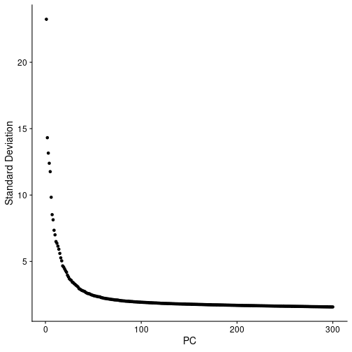
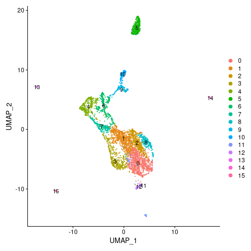
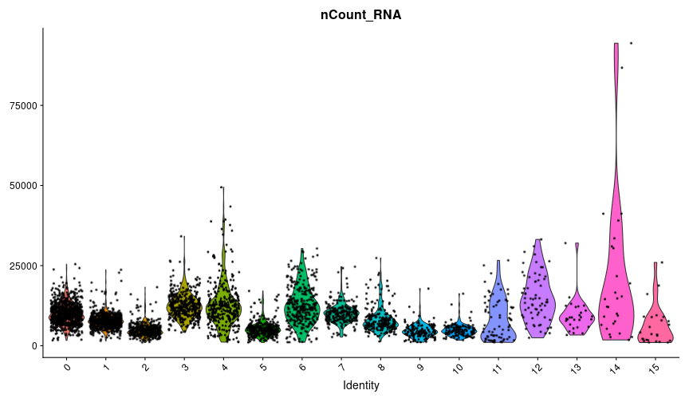
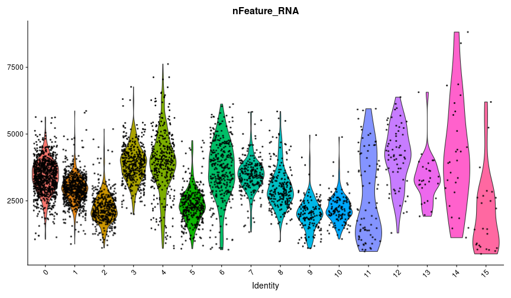
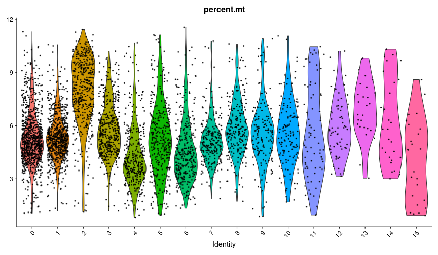
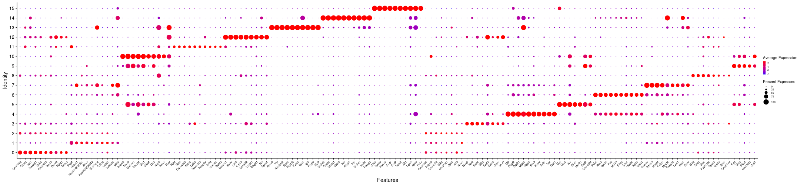
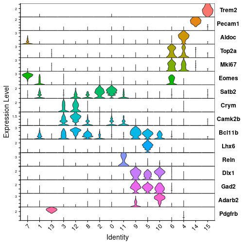
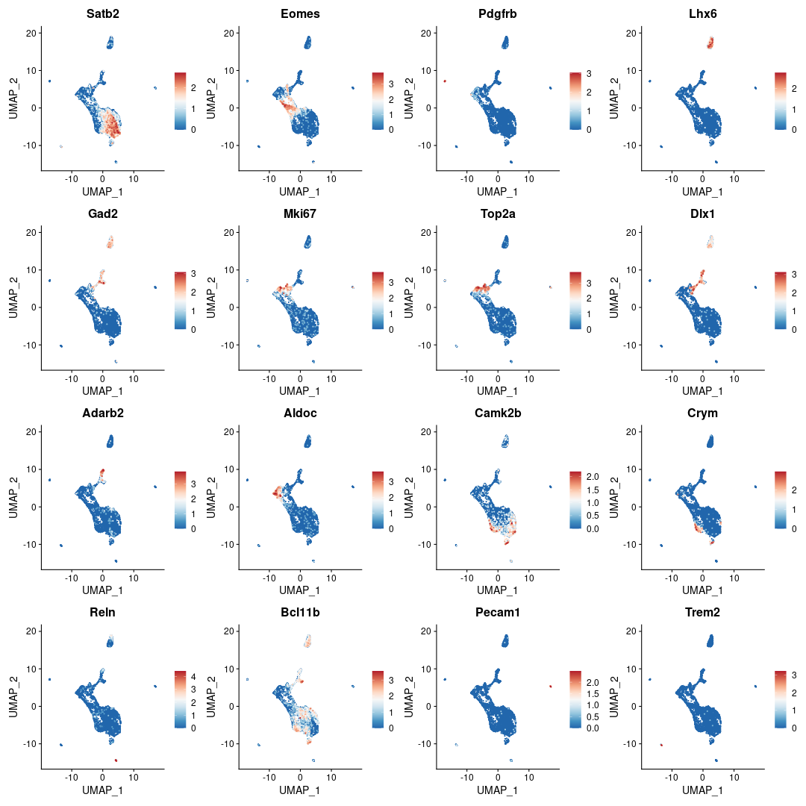
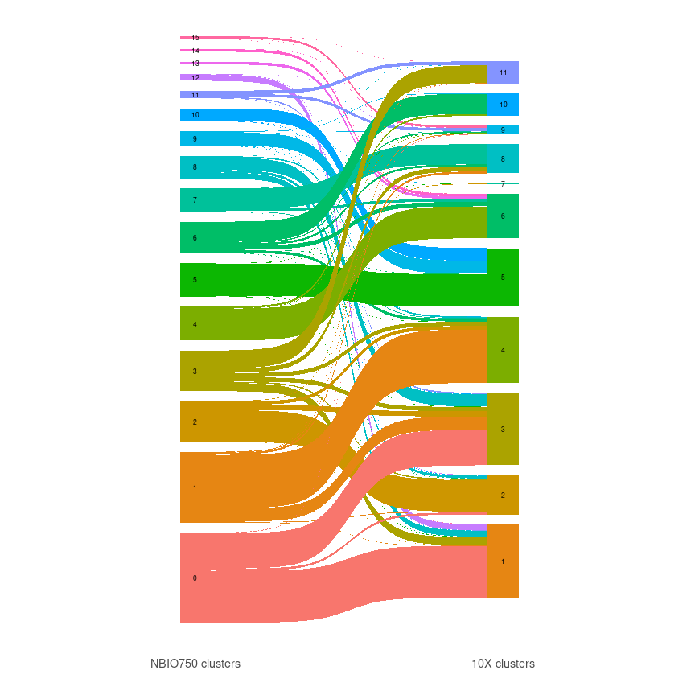
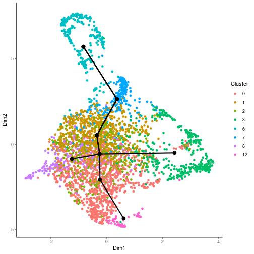

---  
title: "NBIO750: Neuroanalytics scRNA-seq workshop"
output: github_document
toc: yes 
---


# Intro and source data retrieval
We will be working with a publicly available 10X dataset generated from 5,000 E18 Mouse E18 Cortex, Hippocampus, and Subventricular Zone Cells

We'll first create a working directory somewhere on Longleaf for data and results to be stored. Change path to a directory of your own choosing

```bash
mkdir /pine/scr/j/m/jmsimon/NBIO750_032022/
cd /pine/scr/j/m/jmsimon/NBIO750_032022/
```

We then retrieve CellRanger output data for this test set directly from the 10X website

```bash
wget https://cf.10xgenomics.com/samples/cell-exp/6.0.0/SC3_v3_NextGem_DI_Neurons_5K_SC3_v3_NextGem_DI_Neurons_5K/SC3_v3_NextGem_DI_Neurons_5K_SC3_v3_NextGem_DI_Neurons_5K_count_sample_feature_bc_matrix.tar.gz
```

Alternatively these data can be copied to your directory of choice from my pine space

```bash
cp /pine/scr/j/m/jmsimon/NBIO750_032022/SC3_v3_NextGem_DI_Neurons_5K_SC3_v3_NextGem_DI_Neurons_5K_count_sample_feature_bc_matrix.tar.gz /pine/scr/j/m/jmsimon/NBIO750_032022/
```

Next we decompress to get the full CellRanger output directory

```bash
tar -xzvf SC3_v3_NextGem_DI_Neurons_5K_SC3_v3_NextGem_DI_Neurons_5K_count_sample_feature_bc_matrix.tar.gz
```

# Importing data into R/Seurat

I typically use OnDemand (https://ondemand.rc.unc.edu/pun/sys/dashboard), which launches R/RStudio v4.1 on Longleaf

Request for 4 hours, 1 node, GCC 6.3.0, and add "--mem=50g" to the additional arguments

We will need the following packages installed. Most can be installed via `install.packages("packageX")`, except where noted 

Once everything has been installed successfully, load them all for this session


```r
library(data.table)
```

```
## data.table 1.14.2 using 5 threads (see ?getDTthreads).  Latest news: r-datatable.com
```

```r
library(devtools)
```

```
## Loading required package: usethis
```

```r
library(presto)					# devtools::install_github('immunogenomics/presto')
```

```
## Loading required package: Rcpp
```

```r
library(glmGamPoi)				# BiocManager::install("glmGamPoi")
library(sctransform)			# devtools::install_github("satijalab/sctransform", ref = "develop")
library(Seurat)
```

```
## Attaching SeuratObject
```

```r
library(tidyverse)
```

```
## ── Attaching packages ─────────────────────────────────────────────────────────────────────────── tidyverse 1.3.1 ──
```

```
## ✓ ggplot2 3.3.5     ✓ purrr   0.3.4
## ✓ tibble  3.1.6     ✓ dplyr   1.0.8
## ✓ tidyr   1.2.0     ✓ stringr 1.4.0
## ✓ readr   2.1.2     ✓ forcats 0.5.1
```

```
## ── Conflicts ────────────────────────────────────────────────────────────────────────────── tidyverse_conflicts() ──
## x dplyr::between()   masks data.table::between()
## x dplyr::filter()    masks stats::filter()
## x dplyr::first()     masks data.table::first()
## x dplyr::lag()       masks stats::lag()
## x dplyr::last()      masks data.table::last()
## x purrr::transpose() masks data.table::transpose()
```

```r
library(miQC)					# BiocManager::install("miQC")	
library(SeuratWrappers)			# remotes::install_github('satijalab/seurat-wrappers')
library(flexmix)
```

```
## Loading required package: lattice
```

```r
library(SingleCellExperiment)
```

```
## Loading required package: SummarizedExperiment
```

```
## Loading required package: MatrixGenerics
```

```
## Loading required package: matrixStats
```

```
## 
## Attaching package: 'matrixStats'
```

```
## The following object is masked from 'package:dplyr':
## 
##     count
```

```
## 
## Attaching package: 'MatrixGenerics'
```

```
## The following objects are masked from 'package:matrixStats':
## 
##     colAlls, colAnyNAs, colAnys, colAvgsPerRowSet, colCollapse, colCounts, colCummaxs, colCummins,
##     colCumprods, colCumsums, colDiffs, colIQRDiffs, colIQRs, colLogSumExps, colMadDiffs, colMads,
##     colMaxs, colMeans2, colMedians, colMins, colOrderStats, colProds, colQuantiles, colRanges,
##     colRanks, colSdDiffs, colSds, colSums2, colTabulates, colVarDiffs, colVars, colWeightedMads,
##     colWeightedMeans, colWeightedMedians, colWeightedSds, colWeightedVars, rowAlls, rowAnyNAs, rowAnys,
##     rowAvgsPerColSet, rowCollapse, rowCounts, rowCummaxs, rowCummins, rowCumprods, rowCumsums,
##     rowDiffs, rowIQRDiffs, rowIQRs, rowLogSumExps, rowMadDiffs, rowMads, rowMaxs, rowMeans2,
##     rowMedians, rowMins, rowOrderStats, rowProds, rowQuantiles, rowRanges, rowRanks, rowSdDiffs,
##     rowSds, rowSums2, rowTabulates, rowVarDiffs, rowVars, rowWeightedMads, rowWeightedMeans,
##     rowWeightedMedians, rowWeightedSds, rowWeightedVars
```

```
## Loading required package: GenomicRanges
```

```
## Loading required package: stats4
```

```
## Loading required package: BiocGenerics
```

```
## 
## Attaching package: 'BiocGenerics'
```

```
## The following object is masked from 'package:flexmix':
## 
##     unique
```

```
## The following objects are masked from 'package:dplyr':
## 
##     combine, intersect, setdiff, union
```

```
## The following objects are masked from 'package:stats':
## 
##     IQR, mad, sd, var, xtabs
```

```
## The following objects are masked from 'package:base':
## 
##     anyDuplicated, append, as.data.frame, basename, cbind, colnames, dirname, do.call, duplicated,
##     eval, evalq, Filter, Find, get, grep, grepl, intersect, is.unsorted, lapply, Map, mapply, match,
##     mget, order, paste, pmax, pmax.int, pmin, pmin.int, Position, rank, rbind, Reduce, rownames,
##     sapply, setdiff, sort, table, tapply, union, unique, unsplit, which.max, which.min
```

```
## Loading required package: S4Vectors
```

```
## 
## Attaching package: 'S4Vectors'
```

```
## The following objects are masked from 'package:dplyr':
## 
##     first, rename
```

```
## The following object is masked from 'package:tidyr':
## 
##     expand
```

```
## The following objects are masked from 'package:data.table':
## 
##     first, second
```

```
## The following objects are masked from 'package:base':
## 
##     expand.grid, I, unname
```

```
## Loading required package: IRanges
```

```
## 
## Attaching package: 'IRanges'
```

```
## The following objects are masked from 'package:dplyr':
## 
##     collapse, desc, slice
```

```
## The following object is masked from 'package:purrr':
## 
##     reduce
```

```
## The following object is masked from 'package:data.table':
## 
##     shift
```

```
## Loading required package: GenomeInfoDb
```

```
## Loading required package: Biobase
```

```
## Welcome to Bioconductor
## 
##     Vignettes contain introductory material; view with 'browseVignettes()'. To cite Bioconductor, see
##     'citation("Biobase")', and for packages 'citation("pkgname")'.
```

```
## 
## Attaching package: 'Biobase'
```

```
## The following object is masked from 'package:MatrixGenerics':
## 
##     rowMedians
```

```
## The following objects are masked from 'package:matrixStats':
## 
##     anyMissing, rowMedians
```

```
## 
## Attaching package: 'SummarizedExperiment'
```

```
## The following object is masked from 'package:SeuratObject':
## 
##     Assays
```

```
## The following object is masked from 'package:Seurat':
## 
##     Assays
```

```r
library(SummarizedExperiment)
library(RColorBrewer)
library(ggsankey)				# devtools::install_github("davidsjoberg/ggsankey")
```

Now we'll set our working directory to the same path that holds our 10X data

```r
setwd("/pine/scr/j/m/jmsimon/NBIO750_032022/")
```

Import 10X CellRanger data directory

```r
brain5k <- Read10X(data.dir="sample_feature_bc_matrix/")
```

Convert to Seurat object

```r
brain5k.seurat <- CreateSeuratObject(brain5k)
```

Peek at top corner of data matrix

```r
brain5k.seurat@assays$RNA[1:5,1:5]
```

```
## 5 x 5 sparse Matrix of class "dgCMatrix"
##         AAACCCACAAGAAATC-1 AAACCCACAGTAGATA-1 AAACCCACATCGATGT-1 AAACCCATCCGTATGA-1 AAACCCATCGGAGCAA-1
## Xkr4                     .                  .                  1                  .                  .
## Gm1992                   .                  .                  .                  .                  .
## Gm19938                  .                  .                  .                  .                  .
## Gm37381                  .                  .                  .                  .                  .
## Rp1                      .                  .                  .                  .                  .
```

# Initial filtering and QC
Filter out low quality cells. I first use a combination of a minimum number of UMIs per cell (nCount_RNA) and minimum number of genes detected per cell (nFeatures_RNA)

In practice, this may need to be derived/optimized empirically for a new dataset. Some more information [here](https://satijalab.org/seurat/articles/pbmc3k_tutorial.html#qc-and-selecting-cells-for-further-analysis-1)

I first save this to a "test" object name to do the filter non-destructively. After each tweak of the cutoffs, I check the dimensions of the object (genes, cells)


```r
test <- subset(brain5k.seurat, subset = nCount_RNA > 1000 & nFeature_RNA > 500)
dim(test)
```

```
## [1] 32285  5120
```


Once satisfied with the basic filtering criteria, I'll overwrite my main seurat object with the filtered one, then proceed with using [MiQC](https://doi.org/10.1371/journal.pcbi.1009290) to remove other poor-quality cells based on mitochondrial contribution

```r
brain5k.seurat <- subset(brain5k.seurat, subset = nCount_RNA > 1000 & nFeature_RNA > 500)
brain5k.seurat <- PercentageFeatureSet(brain5k.seurat, pattern = "^mt-", col.name = "percent.mt")
brain5k.seurat <- RunMiQC(brain5k.seurat, 
					percent.mt = "percent.mt", 
					nFeature_RNA = "nFeature_RNA", 
					posterior.cutoff = 0.75, 
					model.slot = "flexmix_model")
```

```
## Warning: Adding a command log without an assay associated with it
```

```r
brain5k.seurat <- subset(brain5k.seurat, miQC.keep == "keep")
```

Get dimensions of my filtered object

```r
dim(brain5k.seurat)
```

```
## [1] 32285  4446
```


# Normalize and scale data
The default behavior is to only report scaled counts for a few thousand variably expressed genes, so we edit that to report scaled counts for all genes

The [basic Seurat vignettes](https://satijalab.org/seurat/articles/pbmc3k_tutorial.html#normalizing-the-data-1) suggest using NormalizeData() and ScaleData(). SCTransform is likely better statistically and replaces both, however you can choose to use either approach


```r
brain5k.seurat <- SCTransform(brain5k.seurat, vst.flavor = "v2", return.only.var.genes = F)
```

```
## vst.flavor='v2' set, setting model to use fixed slope and exclude poisson genes.
```

```
## Calculating cell attributes from input UMI matrix: log_umi
```

```
## Total Step 1 genes: 17004
```

```
## Total overdispersed genes: 14563
```

```
## Excluding 2441 genes from Step 1 because they are not overdispersed.
```

```
## Variance stabilizing transformation of count matrix of size 17004 by 4446
```

```
## Model formula is y ~ log_umi
```

```
## Get Negative Binomial regression parameters per gene
```

```
## Using 2000 genes, 4446 cells
```

```
## 
  |                                                                                                                
  |                                                                                                          |   0%
  |                                                                                                                
  |==========================                                                                                |  25%
  |                                                                                                                
  |=====================================================                                                     |  50%
  |                                                                                                                
  |================================================================================                          |  75%
  |                                                                                                                
  |==========================================================================================================| 100%
```

```
## Setting estimate of  52 genes to inf as theta_mm/theta_mle < 1e-3
```

```
## # of step1 poisson genes (variance < mean): 0
```

```
## # of low mean genes (mean < 0.001): 0
```

```
## Total # of Step1 poisson genes (theta=Inf; variance < mean): 52
```

```
## Total # of poisson genes (theta=Inf; variance < mean): 2441
```

```
## Calling offset model for all 2441 poisson genes
```

```
## Found 102 outliers - those will be ignored in fitting/regularization step
```

```
## Ignoring theta inf genes
```

```
## Replacing fit params for 2441 poisson genes by theta=Inf
```

```
## Setting min_variance based on median UMI:  0.04
```

```
## Second step: Get residuals using fitted parameters for 17004 genes
```

```
## 
  |                                                                                                                
  |                                                                                                          |   0%
  |                                                                                                                
  |===                                                                                                       |   3%
  |                                                                                                                
  |======                                                                                                    |   6%
  |                                                                                                                
  |=========                                                                                                 |   9%
  |                                                                                                                
  |============                                                                                              |  11%
  |                                                                                                                
  |===============                                                                                           |  14%
  |                                                                                                                
  |==================                                                                                        |  17%
  |                                                                                                                
  |=====================                                                                                     |  20%
  |                                                                                                                
  |========================                                                                                  |  23%
  |                                                                                                                
  |===========================                                                                               |  26%
  |                                                                                                                
  |==============================                                                                            |  29%
  |                                                                                                                
  |=================================                                                                         |  31%
  |                                                                                                                
  |====================================                                                                      |  34%
  |                                                                                                                
  |=======================================                                                                   |  37%
  |                                                                                                                
  |==========================================                                                                |  40%
  |                                                                                                                
  |=============================================                                                             |  43%
  |                                                                                                                
  |================================================                                                          |  46%
  |                                                                                                                
  |===================================================                                                       |  49%
  |                                                                                                                
  |=======================================================                                                   |  51%
  |                                                                                                                
  |==========================================================                                                |  54%
  |                                                                                                                
  |=============================================================                                             |  57%
  |                                                                                                                
  |================================================================                                          |  60%
  |                                                                                                                
  |===================================================================                                       |  63%
  |                                                                                                                
  |======================================================================                                    |  66%
  |                                                                                                                
  |=========================================================================                                 |  69%
  |                                                                                                                
  |============================================================================                              |  71%
  |                                                                                                                
  |===============================================================================                           |  74%
  |                                                                                                                
  |==================================================================================                        |  77%
  |                                                                                                                
  |=====================================================================================                     |  80%
  |                                                                                                                
  |========================================================================================                  |  83%
  |                                                                                                                
  |===========================================================================================               |  86%
  |                                                                                                                
  |==============================================================================================            |  89%
  |                                                                                                                
  |=================================================================================================         |  91%
  |                                                                                                                
  |====================================================================================================      |  94%
  |                                                                                                                
  |=======================================================================================================   |  97%
  |                                                                                                                
  |==========================================================================================================| 100%
```

```
## Computing corrected count matrix for 17004 genes
```

```
## 
  |                                                                                                                
  |                                                                                                          |   0%
  |                                                                                                                
  |===                                                                                                       |   3%
  |                                                                                                                
  |======                                                                                                    |   6%
  |                                                                                                                
  |=========                                                                                                 |   9%
  |                                                                                                                
  |============                                                                                              |  11%
  |                                                                                                                
  |===============                                                                                           |  14%
  |                                                                                                                
  |==================                                                                                        |  17%
  |                                                                                                                
  |=====================                                                                                     |  20%
  |                                                                                                                
  |========================                                                                                  |  23%
  |                                                                                                                
  |===========================                                                                               |  26%
  |                                                                                                                
  |==============================                                                                            |  29%
  |                                                                                                                
  |=================================                                                                         |  31%
  |                                                                                                                
  |====================================                                                                      |  34%
  |                                                                                                                
  |=======================================                                                                   |  37%
  |                                                                                                                
  |==========================================                                                                |  40%
  |                                                                                                                
  |=============================================                                                             |  43%
  |                                                                                                                
  |================================================                                                          |  46%
  |                                                                                                                
  |===================================================                                                       |  49%
  |                                                                                                                
  |=======================================================                                                   |  51%
  |                                                                                                                
  |==========================================================                                                |  54%
  |                                                                                                                
  |=============================================================                                             |  57%
  |                                                                                                                
  |================================================================                                          |  60%
  |                                                                                                                
  |===================================================================                                       |  63%
  |                                                                                                                
  |======================================================================                                    |  66%
  |                                                                                                                
  |=========================================================================                                 |  69%
  |                                                                                                                
  |============================================================================                              |  71%
  |                                                                                                                
  |===============================================================================                           |  74%
  |                                                                                                                
  |==================================================================================                        |  77%
  |                                                                                                                
  |=====================================================================================                     |  80%
  |                                                                                                                
  |========================================================================================                  |  83%
  |                                                                                                                
  |===========================================================================================               |  86%
  |                                                                                                                
  |==============================================================================================            |  89%
  |                                                                                                                
  |=================================================================================================         |  91%
  |                                                                                                                
  |====================================================================================================      |  94%
  |                                                                                                                
  |=======================================================================================================   |  97%
  |                                                                                                                
  |==========================================================================================================| 100%
```

```
## Calculating gene attributes
```

```
## Wall clock passed: Time difference of 20.27892 secs
```

```
## Determine variable features
```

```
## Place corrected count matrix in counts slot
```

```
## Centering data matrix
```

```
## Set default assay to SCT
```

# Dimensionality reduction and clustering
This makes downstream steps like clustering more computationally feasible without sacrificing much information content

We first run PCA, then determine how many PCs describe the majority of the variability in the data with an elbow plot

```r
brain5k.seurat <- RunPCA(brain5k.seurat, verbose = FALSE, npcs = 300)
ElbowPlot(brain5k.seurat, ndims = 300, reduction = "pca")
```



Next we run UMAP on the top N principal components determined above (here I chose n=40). 
UMAP is one of several ways to plot those 40+ dimensional data on just two axes, but it can be dangerous/misleading. 

tSNE is a similar alternative approach with similar limitations, Seurat can generate these coordinates instead with `RunTSNE()`


```r
brain5k.seurat <- RunUMAP(brain5k.seurat, dims = 1:40)
```

```
## Warning: The default method for RunUMAP has changed from calling Python UMAP via reticulate to the R-native UWOT using the cosine metric
## To use Python UMAP via reticulate, set umap.method to 'umap-learn' and metric to 'correlation'
## This message will be shown once per session
```

```
## 22:12:18 UMAP embedding parameters a = 0.9922 b = 1.112
```

```
## 22:12:18 Read 4446 rows and found 40 numeric columns
```

```
## 22:12:18 Using Annoy for neighbor search, n_neighbors = 30
```

```
## 22:12:18 Building Annoy index with metric = cosine, n_trees = 50
```

```
## 0%   10   20   30   40   50   60   70   80   90   100%
```

```
## [----|----|----|----|----|----|----|----|----|----|
```

```
## **************************************************|
## 22:12:19 Writing NN index file to temp file /tmp/Rtmp6sdegL/file1113c4140c7ee5
## 22:12:19 Searching Annoy index using 1 thread, search_k = 3000
## 22:12:20 Annoy recall = 100%
## 22:12:20 Commencing smooth kNN distance calibration using 1 thread
## 22:12:21 Initializing from normalized Laplacian + noise
## 22:12:21 Commencing optimization for 500 epochs, with 171438 positive edges
## 22:12:25 Optimization finished
```

Next we identify cell clusters/putative cell types, using information from the top 40 PCs (notably we _do not and should not_ use the 2D UMAP/tSNE coordinates at all for this)

`FindClusters()` has two key parameters, `resolution` and `algorithm`. For every dataset I work with, I set `algorithm=2`. `resolution` relates to the stringency of clustering, and will need to be derived empirically for each new dataset. I usually start with `resolution=1` and go up or down in increments of 0.5 if I want more or fewer clusters, respectively.

Here I've pre-determined that `resolution=0.5` works well for these data


```r
brain5k.seurat <- FindNeighbors(brain5k.seurat, dims = 1:40, verbose = FALSE)
brain5k.seurat <- FindClusters(brain5k.seurat, resolution = 0.5, algorithm=2)
```

```
## Modularity Optimizer version 1.3.0 by Ludo Waltman and Nees Jan van Eck
## 
## Number of nodes: 4446
## Number of edges: 140343
## 
## Running Louvain algorithm with multilevel refinement...
## Maximum modularity in 10 random starts: 0.8797
## Number of communities: 16
## Elapsed time: 0 seconds
```

Plot our UMAP labeled by cluster identity. Yours likely will look subtly different than mine

```r
DimPlot(brain5k.seurat,reduction = "umap", label = TRUE)
```



Check QC of each cluster by plotting number of UMIs/cell, number of genes/cell, and percent mitochondrial contribution

Here we want to make sure no cluster appears to be an outlier compared to others

```r
VlnPlot(brain5k.seurat, features = "nCount_RNA",group.by="seurat_clusters") + NoLegend()
```



```r
VlnPlot(brain5k.seurat, features = "nFeature_RNA",group.by="seurat_clusters") + NoLegend()
```



```r
VlnPlot(brain5k.seurat, features = "percent.mt",group.by="seurat_clusters") + NoLegend()
```




# Identification and plotting of top marker genes expressed in each cluster

We will use an ultra-fast tool called Presto for this. Seurat's FindMarkers/FindAllMarkers is also appropriate

Here we're taking just the top 10 significant hits per cluster and plotting a dot plot of those markers, using scaled+normalized expression values


```r
vargenes <- presto::wilcoxauc(brain5k.seurat, 'seurat_clusters', seurat_assay = 'SCT')
top_vargenes <- top_markers(vargenes, n = 10, auc_min = 0.5, pct_in_min = 20, pct_out_max = 20)

all_markers <- top_vargenes %>%
	select(-rank) %>% 
	unclass() %>% 
	stack() %>%
	pull(values) %>%
	unique() %>%
	.[!is.na(.)]


DotPlot(brain5k.seurat,features=all_markers,cols = c("blue","red")) + 
	RotatedAxis() + 
	theme(axis.text.x = element_text(size = 7), 
		legend.key.size = unit(0.25, 'cm'),
		legend.title = element_text(size=10), 
		legend.text = element_text(size=7))
```



I extracted out a short list of canonical markers for two more focused figures

First a violin plot of marker expression in each cluster

```r
goi <- c("Satb2","Eomes","Pdgfrb","Lhx6",
			"Gad2","Mki67","Top2a","Dlx1",
			"Adarb2","Aldoc","Camk2b","Crym",
			"Reln","Bcl11b","Pecam1","Trem2")
VlnPlot(brain5k.seurat, features = goi, stack=T, flip=T, sort=T, assay="SCT") + NoLegend()
```



Then a scatterplot of marker expression in UMAP space

```r
FeaturePlot(brain5k.seurat, features = goi, slot="data", ncol = 4, order = T) & 
	scale_colour_gradientn(colours = rev(brewer.pal(n = 9, name = "RdBu")))
```

```
## Scale for 'colour' is already present. Adding another scale for 'colour', which will replace the existing scale.
## Scale for 'colour' is already present. Adding another scale for 'colour', which will replace the existing scale.
## Scale for 'colour' is already present. Adding another scale for 'colour', which will replace the existing scale.
## Scale for 'colour' is already present. Adding another scale for 'colour', which will replace the existing scale.
## Scale for 'colour' is already present. Adding another scale for 'colour', which will replace the existing scale.
## Scale for 'colour' is already present. Adding another scale for 'colour', which will replace the existing scale.
## Scale for 'colour' is already present. Adding another scale for 'colour', which will replace the existing scale.
## Scale for 'colour' is already present. Adding another scale for 'colour', which will replace the existing scale.
## Scale for 'colour' is already present. Adding another scale for 'colour', which will replace the existing scale.
## Scale for 'colour' is already present. Adding another scale for 'colour', which will replace the existing scale.
## Scale for 'colour' is already present. Adding another scale for 'colour', which will replace the existing scale.
## Scale for 'colour' is already present. Adding another scale for 'colour', which will replace the existing scale.
## Scale for 'colour' is already present. Adding another scale for 'colour', which will replace the existing scale.
## Scale for 'colour' is already present. Adding another scale for 'colour', which will replace the existing scale.
## Scale for 'colour' is already present. Adding another scale for 'colour', which will replace the existing scale.
## Scale for 'colour' is already present. Adding another scale for 'colour', which will replace the existing scale.
```



Lastly to check how many cells were in each cluster, we can make a quick table


```r
table(brain5k.seurat$seurat_clusters)
```

```
## 
##   0   1   2   3   4   5   6   7   8   9  10  11  12  13  14  15 
## 914 721 417 412 347 341 319 241 226 151 133  78  65  28  28  25
```


# Biological annotation of clusters

Now you can search these genes and attempt to assign a biological identity to these clusters. 
Please refer to: 

* http://zylkalab.org/datamousecortex
* http://mousebrain.org/adolescent/genesearch.html
* https://celltypes.brain-map.org/rnaseq/mouse_ctx-hpf_10x?selectedVisualization=Heatmap&colorByFeature=Cell+Type&colorByFeatureValue=Gad1

If you’re a more spatially oriented person and already have an understanding of cortical/hippocampal development at E18, you can try using: 

* https://developingmouse.brain-map.org/

Note only some genes will be present, since RNA ISH probes were not tested for all genes

Spend some time and try to put together the puzzle! 


# Save your R session

```r
save.image("NBIO750_2022-04-02.Rdata")
```

# Get session info

```r
sessionInfo()
```

```
## R version 4.1.0 (2021-05-18)
## Platform: x86_64-pc-linux-gnu (64-bit)
## Running under: Red Hat Enterprise Linux 8.5 (Ootpa)
## 
## Matrix products: default
## BLAS/LAPACK: /nas/longleaf/rhel8/apps/r/4.1.0/lib/libopenblas_haswellp-r0.3.5.so
## 
## locale:
##  [1] LC_CTYPE=en_US.UTF-8       LC_NUMERIC=C               LC_TIME=en_US.UTF-8        LC_COLLATE=en_US.UTF-8    
##  [5] LC_MONETARY=en_US.UTF-8    LC_MESSAGES=en_US.UTF-8    LC_PAPER=en_US.UTF-8       LC_NAME=C                 
##  [9] LC_ADDRESS=C               LC_TELEPHONE=C             LC_MEASUREMENT=en_US.UTF-8 LC_IDENTIFICATION=C       
## 
## attached base packages:
## [1] stats4    stats     graphics  grDevices utils     datasets  methods   base     
## 
## other attached packages:
##  [1] ggsankey_0.0.99999          RColorBrewer_1.1-3          SingleCellExperiment_1.16.0 SummarizedExperiment_1.24.0
##  [5] Biobase_2.54.0              GenomicRanges_1.46.1        GenomeInfoDb_1.30.1         IRanges_2.28.0             
##  [9] S4Vectors_0.32.4            BiocGenerics_0.40.0         MatrixGenerics_1.6.0        matrixStats_0.62.0         
## [13] flexmix_2.3-17              lattice_0.20-45             SeuratWrappers_0.3.0        miQC_1.2.0                 
## [17] forcats_0.5.1               stringr_1.4.0               dplyr_1.0.8                 purrr_0.3.4                
## [21] readr_2.1.2                 tidyr_1.2.0                 tibble_3.1.6                ggplot2_3.3.5              
## [25] tidyverse_1.3.1             SeuratObject_4.0.4          Seurat_4.1.0                sctransform_0.3.3          
## [29] glmGamPoi_1.6.0             presto_1.0.0                Rcpp_1.0.8.3                devtools_2.4.3             
## [33] usethis_2.1.5               data.table_1.14.2           rmarkdown_2.12              knitr_1.37                 
## 
## loaded via a namespace (and not attached):
##   [1] utf8_1.2.2                R.utils_2.11.0            reticulate_1.24           tidyselect_1.1.2         
##   [5] htmlwidgets_1.5.4         grid_4.1.0                Rtsne_0.15                munsell_0.5.0            
##   [9] codetools_0.2-18          ica_1.0-2                 future_1.24.0             miniUI_0.1.1.1           
##  [13] withr_2.5.0               spatstat.random_2.1-0     colorspace_2.0-3          highr_0.9                
##  [17] rstudioapi_0.13           ROCR_1.0-11               tensor_1.5                listenv_0.8.0            
##  [21] labeling_0.4.2            GenomeInfoDbData_1.2.7    polyclip_1.10-0           farver_2.1.0             
##  [25] rprojroot_2.0.2           parallelly_1.30.0         vctrs_0.4.1               generics_0.1.2           
##  [29] xfun_0.30                 R6_2.5.1                  ggbeeswarm_0.6.0          rsvd_1.0.5               
##  [33] bitops_1.0-7              spatstat.utils_2.3-0      cachem_1.0.6              DelayedArray_0.20.0      
##  [37] assertthat_0.2.1          promises_1.2.0.1          scales_1.2.0              nnet_7.3-17              
##  [41] beeswarm_0.4.0            gtable_0.3.0              Cairo_1.5-14              globals_0.14.0           
##  [45] processx_3.5.2            goftest_1.2-3             rlang_1.0.2               splines_4.1.0            
##  [49] lazyeval_0.2.2            spatstat.geom_2.3-2       broom_0.7.12              BiocManager_1.30.16      
##  [53] reshape2_1.4.4            abind_1.4-5               modelr_0.1.8              backports_1.4.1          
##  [57] httpuv_1.6.5              tools_4.1.0               ellipsis_0.3.2            spatstat.core_2.4-0      
##  [61] sessioninfo_1.2.2         ggridges_0.5.3            plyr_1.8.7                sparseMatrixStats_1.6.0  
##  [65] zlibbioc_1.40.0           RCurl_1.98-1.6            ps_1.6.0                  prettyunits_1.1.1        
##  [69] rpart_4.1.16              deldir_1.0-6              pbapply_1.5-0             cowplot_1.1.1            
##  [73] zoo_1.8-9                 haven_2.4.3               ggrepel_0.9.1             cluster_2.1.2            
##  [77] fs_1.5.2                  magrittr_2.0.2            RSpectra_0.16-0           scattermore_0.8          
##  [81] lmtest_0.9-39             reprex_2.0.1              RANN_2.6.1                fitdistrplus_1.1-6       
##  [85] pkgload_1.2.4             hms_1.1.1                 patchwork_1.1.1           mime_0.12                
##  [89] evaluate_0.15             xtable_1.8-4              readxl_1.3.1              gridExtra_2.3            
##  [93] testthat_3.1.2            compiler_4.1.0            KernSmooth_2.23-20        crayon_1.5.1             
##  [97] R.oo_1.24.0               htmltools_0.5.2           mgcv_1.8-39               later_1.3.0              
## [101] tzdb_0.2.0                lubridate_1.8.0           DBI_1.1.2                 dbplyr_2.1.1             
## [105] MASS_7.3-55               Matrix_1.4-0              brio_1.1.3                cli_3.2.0                
## [109] R.methodsS3_1.8.1         parallel_4.1.0            igraph_1.2.11             pkgconfig_2.0.3          
## [113] plotly_4.10.0             spatstat.sparse_2.1-0     xml2_1.3.3                vipor_0.4.5              
## [117] XVector_0.34.0            rvest_1.0.2               callr_3.7.0               digest_0.6.29            
## [121] RcppAnnoy_0.0.19          spatstat.data_2.1-2       cellranger_1.1.0          leiden_0.3.9             
## [125] uwot_0.1.11               DelayedMatrixStats_1.16.0 shiny_1.7.1               modeltools_0.2-23        
## [129] lifecycle_1.0.1           nlme_3.1-155              jsonlite_1.8.0            desc_1.4.1               
## [133] viridisLite_0.4.0         fansi_1.0.3               pillar_1.7.0              ggrastr_1.0.1            
## [137] fastmap_1.1.0             httr_1.4.2                pkgbuild_1.3.1            survival_3.2-13          
## [141] glue_1.6.2                remotes_2.4.2             png_0.1-7                 stringi_1.7.6            
## [145] memoise_2.0.1             irlba_2.3.5               future.apply_1.8.1
```


# Introduction
We will be continuing our analysis of a publicly available 10X dataset of E18 mouse cortex cells

In this section, I'll go into a bit more detail about how we perform annotation, as well as the basics of how we may compare against other existing datasets

I'll also introduce how to perform pseudotiming to discover differentiation trajectories within our data

First, launch a fresh R session and load all the same libraries as the previous section


```r
library(data.table)
library(devtools)
library(presto)
library(glmGamPoi)
library(sctransform)
library(Seurat)
library(tidyverse)
library(miQC)	
library(SeuratWrappers)
library(flexmix)
library(SingleCellExperiment)
library(SummarizedExperiment)
library(RColorBrewer)
library(ggsankey)
```

# Load previously saved R session
Now we'll set our working directory to the same path that holds our previously saved R session

```r
setwd("/pine/scr/j/m/jmsimon/NBIO750_032022/")
```

Load our saved session

```r
load("NBIO750_2022-04-02.Rdata")
```

# Manual cell type annotation
Let's peek at our top marker genes detected in each cluster


```r
top_vargenes
```

```
## # A tibble: 10 × 17
##     rank `0`     `1`           `10`    `11`  `12`  `13`  `14`  `15`  `2`   `3`   `4`   `5`   `6`   `7`   `8`   `9`  
##    <int> <chr>   <chr>         <chr>   <chr> <chr> <chr> <chr> <chr> <chr> <chr> <chr> <chr> <chr> <chr> <chr> <chr>
##  1     1 Gm10862 Pcp4          Adarb2  Ndnf  Dync… Abcc9 Slc7… C1qa  Gm36… Nr4a3 Mt3   Maf   Pclaf Eomes Nr2f2 Dlx6…
##  2     2 Clstn2  Hs3st1        Nrxn3   Reln  Sybu  Vtn   Ctla… Tyro… Pdzr… Nrp2  Phgdh Nrxn3 Rrm2  Btbd… Slit2 Gad2 
##  3     3 Itpr1   2600014E21Rik Dlx6os1 Cacn… Lrfn5 Nduf… Slc2… Fcer… Gm16… Snca  Ddah1 Lhx6  Spc24 Mfap4 Tafa2 Sp9  
##  4     4 Jakmip1 Zfhx4         Sox2ot  Nhlh2 Cdh13 Rgs5  Cldn5 C1qc  Sik2  Slit3 Mfge8 Arx   Pbk   Mfng  Dner  Nrxn3
##  5     5 Dok6    A930024E05Rik Dlx1    Calb2 Camk… Higd… Kdr   C1qb  Gm37… Fezf2 Plpp3 Gria1 Mki67 Cels… Ppp1… Dlx1 
##  6     6 Gm38085 Slc30a10      Erbb4   Tmem… Rian  Kcnj8 Adgr… Trem2 Gpc6  Cnih3 Sox9  Nxph1 Birc5 Myo10 Cdh13 Dlx5 
##  7     7 Trim67  Cdh10         Dlx2    Ppp2… Ling… Itga1 Flt1  Aif1  Lrat… Crym  Aldoc Gad2  Tyms  Snhg… Spin… Dlx2 
##  8     8 Rspo3   Lratd1        Nr2f2   Trp73 B3ga… Igf2  Slc7… Lgmn  Gm38… Camk… Ttyh1 Sox2… Ube2c Loxl1 Unc5a Pbx3 
##  9     9 Ndrg1   Sema5a        Prox1   Lhx1… Nin   Pdgf… Itm2a Apoe  Aff2  Lmo7  Tnc   Gm14… Top2a Heg1  Tafa1 Gm27…
## 10    10 Tenm3   Mfng          Rian    Barh… Ephb1 Myl9  Ramp2 Fcrls Nos1  Calb2 Gas1  Erbb4 Cdca7 Gamt  Gm26… Gad1
```

Since the columns are a bit squished, we can extract out markers of a specific cluster with

```r
top_vargenes$`14`
```

```
##  [1] "Slc7a5" "Ctla2a" "Slc2a1" "Cldn5"  "Kdr"    "Adgrl4" "Flt1"   "Slc7a1" "Itm2a"  "Ramp2"
```

```r
top_vargenes$`15`
```

```
##  [1] "C1qa"   "Tyrobp" "Fcer1g" "C1qc"   "C1qb"   "Trem2"  "Aif1"   "Lgmn"   "Apoe"   "Fcrls"
```

```r
top_vargenes$`7`
```

```
##  [1] "Eomes"  "Btbd17" "Mfap4"  "Mfng"   "Celsr1" "Myo10"  "Snhg18" "Loxl1"  "Heg1"   "Gamt"
```

Then compare these against publicly available data from a similar timepoint

Please refer to: 

* http://zylkalab.org/datamousecortex
* http://mousebrain.org/adolescent/genesearch.html
* https://celltypes.brain-map.org/rnaseq/mouse_ctx-hpf_10x?selectedVisualization=Heatmap&colorByFeature=Cell+Type&colorByFeatureValue=Gad1
* https://developingmouse.brain-map.org/


# Comparison to 10X's cluster assignments
Since our data came from 10X, there already exists a classification of these cells using their own clustering approach.

Our methodologies may not be identical, in particular regarding cell/gene filtering, so we don't expect these to be perfect, but we hope they should largely be consistent with one another

First we obtain the published cluster IDs and decompress at the Longleaf command line

```bash
wget https://cf.10xgenomics.com/samples/cell-exp/6.0.0/SC3_v3_NextGem_DI_Neurons_5K_SC3_v3_NextGem_DI_Neurons_5K/SC3_v3_NextGem_DI_Neurons_5K_SC3_v3_NextGem_DI_Neurons_5K_count_analysis.tar.gz
tar -xzvf SC3_v3_NextGem_DI_Neurons_5K_SC3_v3_NextGem_DI_Neurons_5K_count_analysis.tar.gz
```

Then import their cluster membership csv file into our session

```r
clust.10x = read_csv("analysis/clustering/graphclust/clusters.csv")
```

```
## Rows: 5483 Columns: 2
## ── Column specification ────────────────────────────────────────────────────────────────────────────────────────────
## Delimiter: ","
## chr (1): Barcode
## dbl (1): Cluster
## 
## ℹ Use `spec()` to retrieve the full column specification for this data.
## ℹ Specify the column types or set `show_col_types = FALSE` to quiet this message.
```

```r
dim(clust.10x)
```

```
## [1] 5483    2
```

```r
head(clust.10x)
```

```
## # A tibble: 6 × 2
##   Barcode            Cluster
##   <chr>                <dbl>
## 1 AAACCCACAAGAAATC-1       8
## 2 AAACCCACAGTAGATA-1      11
## 3 AAACCCACATCGATGT-1       1
## 4 AAACCCATCCGTATGA-1      10
## 5 AAACCCATCGGAGCAA-1       9
## 6 AAACCCATCTTTCCAA-1       8
```

We then create a tidyverse-ready table of our own cluster annotations


```r
clust.nbio = brain5k.seurat$seurat_clusters
names(clust.nbio) = colnames(brain5k.seurat)
clust.nbio.tbl <- enframe(clust.nbio) %>% 
	dplyr::rename("Barcode" = name, "NBIO.cluster" = value) %>%
	mutate(NBIO.cluster = as.numeric(as.character(NBIO.cluster)))
dim(clust.nbio.tbl)
```

```
## [1] 4446    2
```

```r
head(clust.nbio.tbl)
```

```
## # A tibble: 6 × 2
##   Barcode            NBIO.cluster
##   <chr>                     <dbl>
## 1 AAACCCACAAGAAATC-1            7
## 2 AAACCCACAGTAGATA-1            9
## 3 AAACCCACATCGATGT-1            0
## 4 AAACCCATCCGTATGA-1            4
## 5 AAACCCATCTTTCCAA-1            7
## 6 AAACGAAGTAGGCAGT-1            2
```

Now use tidyverse functions to bring annotations together under one table

Then plot cluster memberships against one another as a sankey plot using ggsankey

Note their cells annotated in clusters 7 and 9 were largely filtered out in our analysis

These cells had very low numbers of genes detected so likely not of good quality


```r
make_long(
	inner_join(clust.10x,clust.nbio.tbl,by="Barcode") %>%
	dplyr::rename("Clusters.10X" = Cluster, "Clusters.NBIO750" = NBIO.cluster),
	Clusters.NBIO750,Clusters.10X) %>%
	ggplot(aes(x = x, 
               next_x = next_x, 
               node = node, 
               next_node = next_node,
               fill = factor(node),
               label = node)) +
  	geom_sankey() +
  	theme_sankey(base_size = 18) +
 	theme(legend.position = "none") +
  	xlab("") +
  	geom_sankey_text(size = 3, color = "black") +
  	scale_x_discrete(breaks = c("Clusters.NBIO750","Clusters.10X"),labels = c("NBIO750 clusters","10X clusters"))
```




# Pseudotiming trajectory analysis of neuronal precursors and excitatory neurons

We will use [slingshot](https://bioconductor.org/packages/release/bioc/html/slingshot.html), though Monocle or other methods may be appropriate as well

Note: how the data are normalized, how many and which genes you focus on, which dimensionality reduction method you use, which trajectory inference tool you use, etc will all influence the resulting lineages.


Load in additional packages needed for pseudotiming

```r
library(princurve)
library(slingshot)
```

```
## Loading required package: TrajectoryUtils
```

We'll extract out the excitatory neuron and progenitor clusters from our object to focus on that trajectory


```r
subset = subset(brain5k.seurat, subset = seurat_clusters %in% c(6,7,1,3,12,8,2,0))
```

Find variably expressed/marker genes just of these cells, using `presto`

```r
vargenes<- presto::wilcoxauc(subset, 'seurat_clusters', seurat_assay = 'SCT')
top_vargenes = top_markers(vargenes, n = 25, auc_min = 0.5, pct_in_min = 10, pct_out_max = 10)

all_markers<- top_vargenes %>%
	select(-rank) %>% 
	unclass() %>% 
	stack() %>%
	pull(values) %>%
	unique() %>%
	.[!is.na(.)]
```


Create filtered data object on just this subset of cells and variable genes

```r
subset.filtered = GetAssayData(subset,assay="SCT")
subset.filtered = subset.filtered[rownames(subset.filtered) %in% all_markers,]
subset.filtered[1:5,1:5]
```

```
## 5 x 5 sparse Matrix of class "dgCMatrix"
##               AAACCCACAAGAAATC-1 AAACCCACATCGATGT-1 AAACCCATCTTTCCAA-1 AAACGAAGTAGGCAGT-1 AAACGCTCACCAGCTG-1
## Vxn                            .                  .          0.6931472                  .                  .
## A830018L16Rik                  .                  .          .                          .                  .
## Tfap2d                         .                  .          0.6931472                  .                  .
## Mcm3                           .                  .          .                          .                  .
## Bend6                          .                  .          .                          .                  .
```


Re-compute UMAP reduction just on these cells and genes

```r
subset.filtered.umap = umap::umap(t(as.matrix(subset.filtered)))
subset.umap = subset.filtered.umap$layout
colnames(subset.umap) = c("Dim1","Dim2")
head(subset.umap)
```

```
##                           Dim1       Dim2
## AAACCCACAAGAAATC-1  0.65799182  1.1110976
## AAACCCACATCGATGT-1 -1.17426763 -2.9626373
## AAACCCATCTTTCCAA-1  0.16527641  2.4372640
## AAACGAAGTAGGCAGT-1 -0.07540186 -0.2288214
## AAACGCTCACCAGCTG-1 -1.23568164  0.1097196
## AAACGCTCAGCGAACA-1  0.59045179  3.6742363
```


Run slingshot

Optional parameters include forcing the trajectory to start or end with a certain cluster, if we knew that to be true. Here we'll let it define the start and end automatically

```r
subset.sling = slingshot(subset.umap, subset$seurat_clusters)
```

Retrieve clusters in lingeage order with

```r
slingLineages(subset.sling)
```

```
## $Lineage1
## [1] "6"  "7"  "1"  "2"  "0"  "12"
## 
## $Lineage2
## [1] "6" "7" "1" "2" "8"
## 
## $Lineage3
## [1] "6" "7" "1" "2" "3"
```

Plot cells in UMAP space, labeled by cluster, with each trajectory shown using ggplot

This code largely follows [this vignette](http://www.bioconductor.org/packages/release/bioc/vignettes/traviz/inst/doc/slingshot.html) or [this one may also be useful](https://bioconductor.org/packages/devel/bioc/vignettes/slingshot/inst/doc/vignette.html). Also check out the R packages [condiments](https://bioconductor.org/packages/release/bioc/html/condiments.html) and [tradeSeq](https://www.bioconductor.org/packages/release/bioc/html/tradeSeq.html) for even more capabilities


```r
df = as.data.frame(cbind(subset.umap,"cl" = as.numeric(as.character(subset$seurat_clusters))))
mst <- slingMST(subset.sling, as.df = TRUE)
colnames(mst) = c("Dim1","Dim2","Order","Lineage","Cluster")

ggplot(df, aes(x = Dim1, y = Dim2)) +
  	geom_point(aes(color = factor(cl))) + 
  	theme_classic() + 
  	geom_point(data = mst, size = 3) +
	geom_path(data = mst %>% arrange(Order), aes(group = Lineage), size = 1) +
	guides(color=guide_legend(title="Cluster"))
```




# Save your R session

```r
save.image("NBIO750_2022-04-03.Rdata")
```

# Get session info

```r
sessionInfo()
```

```
## R version 4.1.0 (2021-05-18)
## Platform: x86_64-pc-linux-gnu (64-bit)
## Running under: Red Hat Enterprise Linux 8.5 (Ootpa)
## 
## Matrix products: default
## BLAS/LAPACK: /nas/longleaf/rhel8/apps/r/4.1.0/lib/libopenblas_haswellp-r0.3.5.so
## 
## locale:
##  [1] LC_CTYPE=en_US.UTF-8       LC_NUMERIC=C               LC_TIME=en_US.UTF-8        LC_COLLATE=en_US.UTF-8    
##  [5] LC_MONETARY=en_US.UTF-8    LC_MESSAGES=en_US.UTF-8    LC_PAPER=en_US.UTF-8       LC_NAME=C                 
##  [9] LC_ADDRESS=C               LC_TELEPHONE=C             LC_MEASUREMENT=en_US.UTF-8 LC_IDENTIFICATION=C       
## 
## attached base packages:
## [1] stats4    stats     graphics  grDevices utils     datasets  methods   base     
## 
## other attached packages:
##  [1] slingshot_2.2.0             TrajectoryUtils_1.2.0       princurve_2.1.6             ggsankey_0.0.99999         
##  [5] RColorBrewer_1.1-3          SingleCellExperiment_1.16.0 SummarizedExperiment_1.24.0 Biobase_2.54.0             
##  [9] GenomicRanges_1.46.1        GenomeInfoDb_1.30.1         IRanges_2.28.0              S4Vectors_0.32.4           
## [13] BiocGenerics_0.40.0         MatrixGenerics_1.6.0        matrixStats_0.62.0          flexmix_2.3-17             
## [17] lattice_0.20-45             SeuratWrappers_0.3.0        miQC_1.2.0                  forcats_0.5.1              
## [21] stringr_1.4.0               dplyr_1.0.8                 purrr_0.3.4                 readr_2.1.2                
## [25] tidyr_1.2.0                 tibble_3.1.6                ggplot2_3.3.5               tidyverse_1.3.1            
## [29] SeuratObject_4.0.4          Seurat_4.1.0                sctransform_0.3.3           glmGamPoi_1.6.0            
## [33] presto_1.0.0                Rcpp_1.0.8.3                devtools_2.4.3              usethis_2.1.5              
## [37] data.table_1.14.2           rmarkdown_2.12              knitr_1.37                 
## 
## loaded via a namespace (and not attached):
##   [1] utf8_1.2.2                R.utils_2.11.0            reticulate_1.24           tidyselect_1.1.2         
##   [5] htmlwidgets_1.5.4         grid_4.1.0                Rtsne_0.15                munsell_0.5.0            
##   [9] codetools_0.2-18          ica_1.0-2                 umap_0.2.7.0              future_1.24.0            
##  [13] miniUI_0.1.1.1            withr_2.5.0               spatstat.random_2.1-0     colorspace_2.0-3         
##  [17] highr_0.9                 rstudioapi_0.13           ROCR_1.0-11               tensor_1.5               
##  [21] listenv_0.8.0             labeling_0.4.2            GenomeInfoDbData_1.2.7    polyclip_1.10-0          
##  [25] bit64_4.0.5               farver_2.1.0              rprojroot_2.0.2           parallelly_1.30.0        
##  [29] vctrs_0.4.1               generics_0.1.2            xfun_0.30                 R6_2.5.1                 
##  [33] ggbeeswarm_0.6.0          rsvd_1.0.5                bitops_1.0-7              spatstat.utils_2.3-0     
##  [37] cachem_1.0.6              DelayedArray_0.20.0       assertthat_0.2.1          vroom_1.5.7              
##  [41] promises_1.2.0.1          scales_1.2.0              nnet_7.3-17               beeswarm_0.4.0           
##  [45] gtable_0.3.0              Cairo_1.5-14              globals_0.14.0            processx_3.5.2           
##  [49] goftest_1.2-3             rlang_1.0.2               splines_4.1.0             lazyeval_0.2.2           
##  [53] spatstat.geom_2.3-2       broom_0.7.12              BiocManager_1.30.16       reshape2_1.4.4           
##  [57] abind_1.4-5               modelr_0.1.8              backports_1.4.1           httpuv_1.6.5             
##  [61] tools_4.1.0               ellipsis_0.3.2            spatstat.core_2.4-0       sessioninfo_1.2.2        
##  [65] ggridges_0.5.3            plyr_1.8.7                sparseMatrixStats_1.6.0   zlibbioc_1.40.0          
##  [69] RCurl_1.98-1.6            ps_1.6.0                  prettyunits_1.1.1         openssl_2.0.0            
##  [73] rpart_4.1.16              deldir_1.0-6              pbapply_1.5-0             cowplot_1.1.1            
##  [77] zoo_1.8-9                 haven_2.4.3               ggrepel_0.9.1             cluster_2.1.2            
##  [81] fs_1.5.2                  magrittr_2.0.2            RSpectra_0.16-0           scattermore_0.8          
##  [85] lmtest_0.9-39             reprex_2.0.1              RANN_2.6.1                fitdistrplus_1.1-6       
##  [89] pkgload_1.2.4             hms_1.1.1                 patchwork_1.1.1           mime_0.12                
##  [93] evaluate_0.15             xtable_1.8-4              readxl_1.3.1              gridExtra_2.3            
##  [97] testthat_3.1.2            compiler_4.1.0            KernSmooth_2.23-20        crayon_1.5.1             
## [101] R.oo_1.24.0               htmltools_0.5.2           mgcv_1.8-39               later_1.3.0              
## [105] tzdb_0.2.0                lubridate_1.8.0           DBI_1.1.2                 dbplyr_2.1.1             
## [109] MASS_7.3-55               Matrix_1.4-0              brio_1.1.3                cli_3.2.0                
## [113] R.methodsS3_1.8.1         parallel_4.1.0            igraph_1.2.11             pkgconfig_2.0.3          
## [117] plotly_4.10.0             spatstat.sparse_2.1-0     xml2_1.3.3                vipor_0.4.5              
## [121] XVector_0.34.0            rvest_1.0.2               callr_3.7.0               digest_0.6.29            
## [125] RcppAnnoy_0.0.19          spatstat.data_2.1-2       cellranger_1.1.0          leiden_0.3.9             
## [129] uwot_0.1.11               DelayedMatrixStats_1.16.0 shiny_1.7.1               modeltools_0.2-23        
## [133] lifecycle_1.0.1           nlme_3.1-155              jsonlite_1.8.0            askpass_1.1              
## [137] desc_1.4.1                viridisLite_0.4.0         fansi_1.0.3               pillar_1.7.0             
## [141] ggrastr_1.0.1             fastmap_1.1.0             httr_1.4.2                pkgbuild_1.3.1           
## [145] survival_3.2-13           glue_1.6.2                remotes_2.4.2             png_0.1-7                
## [149] bit_4.0.4                 stringi_1.7.6             memoise_2.0.1             irlba_2.3.5              
## [153] future.apply_1.8.1
```

